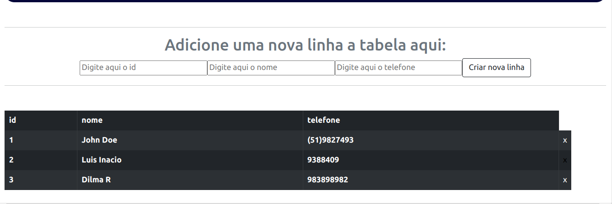
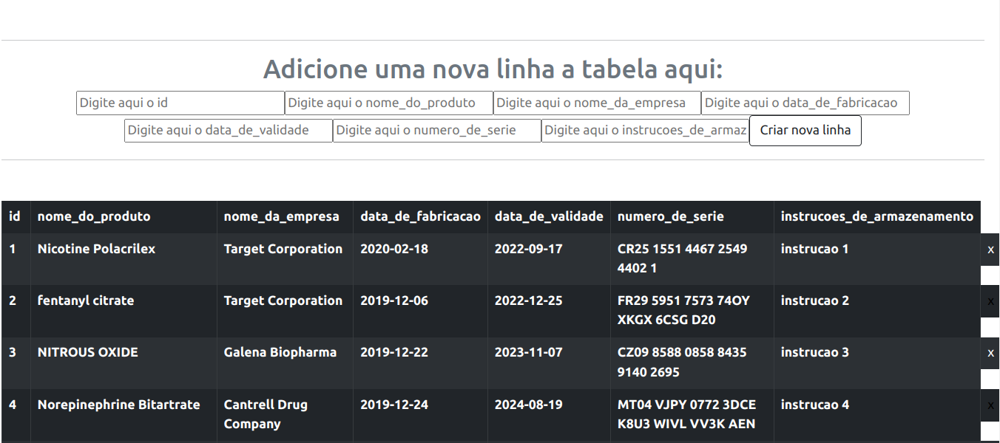

# Desafio Inteligov

## Sobre o projeto

Desafio Técnico para processo seletivo. Consiste em uma aplicação de receber arquivos CSV, gerando para o usuário uma tabela em que ele possa criar, deletar, atualizar os itens da tabela.

## Tecnologias Utilizadas

#### :link: [React](https://pt-br.reactjs.org/docs/getting-started.html)
#### :link: [Bootstrap](https://getbootstrap.com/docs/5.0/getting-started/introduction/)
#### :link: [ReactBootstrap](https://react-bootstrap.github.io/)
#### :link: [Styled Components](https://styled-components.com/)
#### :link: [ESLint](https://eslint.org/)
#### :link: [PapaParse](https://www.papaparse.com/)
#### :link: [FileSaver](https://www.npmjs.com/package/file-saver)

## Instalação

-Clone o repositório através da seguinte chave https: `https://github.com/devwelljr/desafio-inteligov.git`

-Instale as dependências, entrando na raiz dando `npm install`.

-Para rodar a aplicação de `npm start`.

## Como utilizar

### Login: http://localhost:3000/login

A aplicação começa com o cliente tendo que fazer login na `Tabela Inteligov`, onde deve digitar seu `usuário` com no mínimo 4 carácteres e sua senha de no mínimo 6 carácteres.
PS: Como não ha integração com backend qualquer usuário valido faz o login.

### Table: http://localhost:3000/table

Na página principal da aplicação, na parte superior a um header em que aparece o nome do usuário logado. Embaixo ha o input drag and drop que apos inserido um arquivo CSV é gerado um ícone com o nome do arquivo e seu tamanho, ao lado do ícone a um "X" onde e possível retirar o arquivo do input e embaixo a um botão onde é possível baixar a tabela atualizada.

Embaixo do input é possível visualizar a tabela gerada, onde no final de cada linha, ha um "X" que se clicado deleta aquela linha da tabela. Acima da tabela a um formulário onde é possível adicionar uma nova linha a tabela.

No `src` ha um arquivo `example.csv` feito com o exemplo passado com o desafio, mas TODAS as funcionalidades são dinâmicas, possibilitando colocar qualquer aquivo CSV com diferentes colunas.

